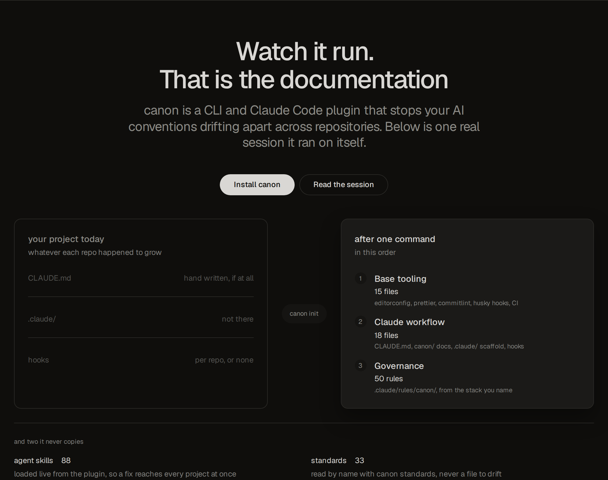
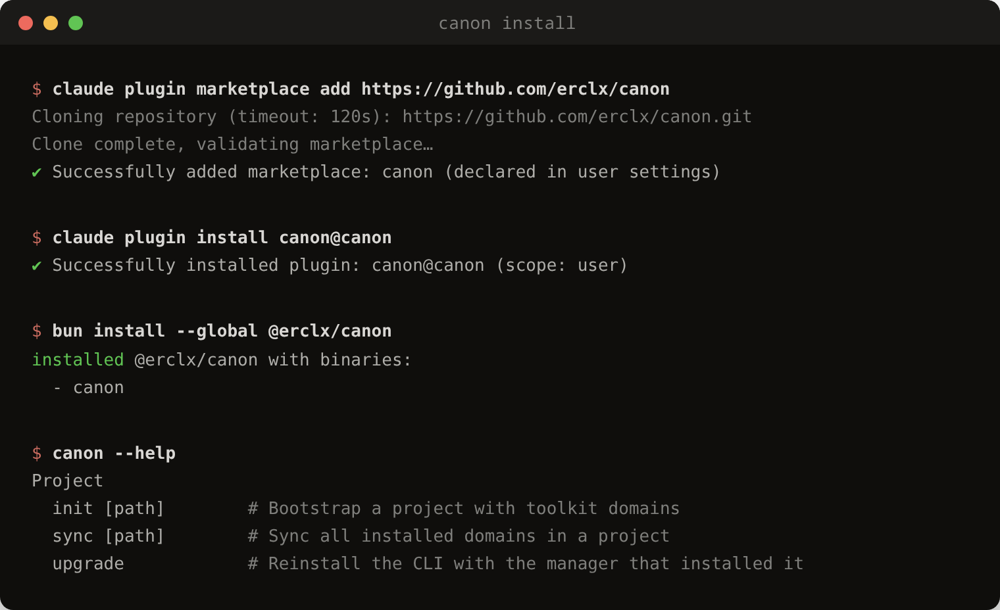
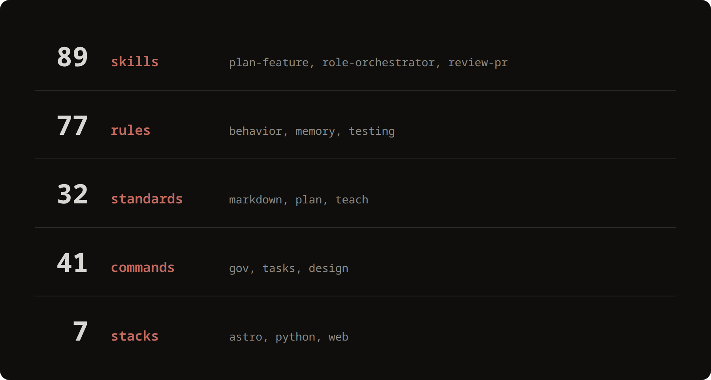
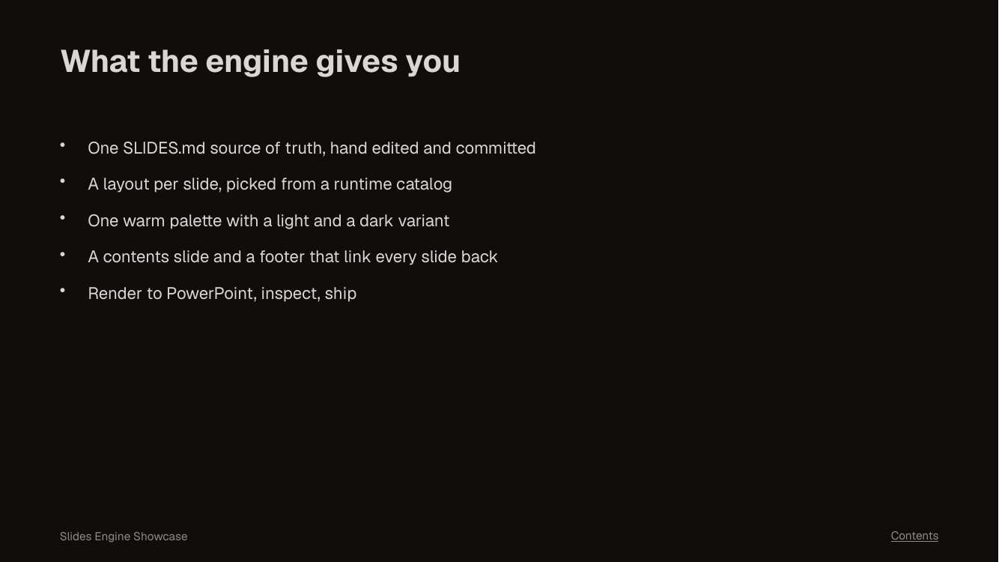
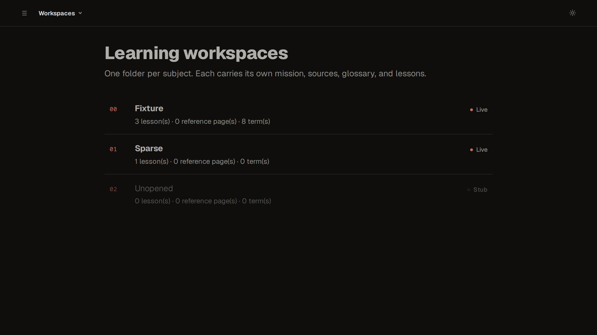

<div align="center">


# canon

[](https://www.npmjs.com/package/@erclx/canon)
[](https://github.com/erclx/canon/actions/workflows/verify.yml)
[](LICENSE)

canon is a CLI and Claude Code plugin that stops your AI conventions drifting apart across repositories. It keeps one authoritative copy and installs it into each project on demand.

**[See it run at canon.erclx.dev](https://canon.erclx.dev)**

</div>



The page is one real session the toolkit ran on itself, and every count on it is read from the repo when the page builds.

## Why

If you work across more than one repository and your AI setup has started to drift between them, this is for you. Every AI coding setup accumulates the same assets. Prompts to reuse, rules agents should follow, slash commands, skills, seed docs, sync scripts. Once you have enough projects, your copies drift and your agents stop getting consistent signals.

Three design choices shape the toolkit.

- Agent-first: every command has a non-interactive path and a JSON catalog. If a Claude Code skill or any other agent cannot drive the CLI without prompts, the design is wrong.
- Text-native: conventions, rules, and prompts are authored as markdown that you and your agents read the same way. No hidden behavior, no compiled state.
- One source, many consumers: this repo is the authoritative copy. Your projects install and sync on demand, never author in place.

Two limits worth knowing before you install. Claude Code is the only agent runtime the plugin targets, and the CLI needs Bun on your path.

## Install

Add the marketplace, then install the Claude Code plugin.

```bash
claude plugin marketplace add https://github.com/erclx/canon
claude plugin install canon@canon
```



The skills land as `/canon:<name>`. If your session was already open, run `/reload-plugins` to pick them up.

Several skills call the `canon` CLI to read catalogs and run installs, and the plugin doesn't put it on your path. Install it from the registry.

```bash
bun install --global @erclx/canon
```

[Bun](https://bun.sh) is the CLI runtime and has to be on your path first. Confirm the install by resolving `canon --help`.

## What is inside

Each domain has a canonical source in this repo and a thin install or sync CLI on your side. The domains split on one line: some are copied into your project and become yours to edit, and some are never copied at all.

| Domain         | What it is                                                                                                               | How it reaches you                                              |
| -------------- | ------------------------------------------------------------------------------------------------------------------------ | --------------------------------------------------------------- |
| Plugin skills  | Skills that plan a feature, review a diff, sync the planning docs, and run the ship chain                                | Loaded live from the plugin, never copied                       |
| Governance     | Coding and authoring rules that load into a Claude session when a matching path is edited                                | Installed per project by `canon gov install`, refreshed by sync |
| Standards      | Authoring conventions for commits, branches, plans, tasks, and markdown                                                  | Opened by name, read by name with `canon standards <name>`      |
| Snippets       | Reusable prompts fired by `@` reference                                                                                  | Resolved live from the plugin                                   |
| Tooling stacks | Golden configs, seeds, and a reference per framework                                                                     | Laid down by `canon init`, reconciled by `canon tooling sync`   |
| Design system  | Ships a `DESIGN.md` token format, a skill that drafts one from an existing project or from scratch, and a render command | `canon design render`                                           |
| Slides         | A `SLIDES.md` source format with a layout catalog                                                                        | `canon slides render` writes PowerPoint                         |
| Transcripts    | A YouTube transcript with metadata frontmatter                                                                           | `canon transcripts <url>` writes it into any repo               |
| Sandbox        | Scenario scaffolds that provision an isolated project state for verifying each domain flow                               | `canon sandbox`                                                 |



Every count in that image is read from the catalogs when it is built, so they're what the repo ships today. A tooling stack lands as real files under version control, because a config is something your build reads and your project owns. A standard stays here and is opened by name, so there is no copy in your repo to drift from this one. Governance is the third shape. A rule with a path glob loads only when a matching path is edited, and a rule with none loads every session. Run `canon gov list` to see the glob beside each rule.

Two of the outputs are documents you open rather than files you run. A `SLIDES.md` renders to a deck, and a learning workspace renders to a small site.





## It runs on itself

The workflow this toolkit ships is the workflow that built it. Several Claude Code sessions run at once, each in its own git worktree on its own branch, and each opens its own pull request.


That recording is the landing page's own `dispatch` and `workers` sections, driven by `canon demo run` against a local build. The branch graph beside the pull request numbers is authored rather than read, because nothing on a build machine records which files four sessions held.

## Documentation

Scaffolding your first project? Start with target projects, then the AI workflow loop. Everything else answers questions that arrive later.

- [AI workflow](docs/workflow/ai-workflow.md): feature-development loop inside a toolkit-managed project
- [Operating model](docs/workflow/operating-model.md): orchestrator, planner, and worker roles for building across parallel sessions
- [Visual design workflow](docs/workflow/visual-design-workflow.md): tiered guide for design and wireframe authoring
- [Target projects](docs/target-projects.md): scaffold, add a domain later, sync upstream drift
- [Agents](docs/agents/index.md): CLI flags, exit codes, and JSON output shapes
- [Docs index](docs/index.md): every reference doc in this repo

## Update

Nothing refreshes on its own. Claude Code ships auto-update off for third-party marketplaces, so an installed copy serves whatever version it was installed at until you refresh it.

```bash
claude plugin marketplace update canon
claude plugin update canon@canon
canon upgrade
```

The first two update the skills, the third updates the CLI, and they move independently. Restart Claude Code, or run `/reload-plugins`, to pick the skills up.

`canon upgrade` reads the package manager off its own install path and reinstalls with that one, so you don't have to remember which put it there. It names what it detected before it runs anything, and it refuses a source checkout rather than reinstalling over your clone.

You don't have to wait until something breaks to find out you're behind. `canon sync --check` and `canon claude skills drift` both report the installed version against the newest published one, and neither changes its exit code over it, so an offline machine reads unknown rather than red.

To stop doing this by hand, turn auto-update on once under `/plugin` in the Marketplaces tab. Confirm what you are running with `canon --version` and `claude plugin list`.

## Development

Working on the toolkit starts from a clone. Running the CLI doesn't, since it installs from the registry. Skip this section unless you're changing the toolkit itself.

### Prerequisites

- [Bun](https://bun.sh) for the CLI runtime and scripts
- [Git](https://git-scm.com) with worktree support
- [GitHub CLI](https://cli.github.com) (optional) for ship flows
- Shell: `zsh` or bash 4+ (`brew install bash` on macOS).

Clone the repo, then run the bootstrap script. It installs dependencies, links the CLI globally, and appends a marked block of Claude Code shell aliases to your `~/.zshrc`.

```bash
git clone https://github.com/erclx/canon.git
cd canon
bun install
bun run bootstrap
```

The script is idempotent, so re-run it after pulling upstream changes without duplicating anything. That also means it leaves an alias block you already have alone rather than refreshing it, so an alias added upstream needs the block deleted and the script re-run. It confirms the install by resolving `canon --help` on the last step. See [zshrc aliases](docs/workflow/zshrc-aliases.md) for what each alias does, how to pick up a new one, and how to opt out of the block.

With the CLI linked, scaffold a fresh project.

```bash
mkdir ~/my-project && cd ~/my-project
git init
canon init
```

`canon init` installs base tooling configs, Claude seeds, and governance rules in one pass, and scaffolds a `.claude/wiki/` stub for your project's own reference pages. Governance defaults to the `base` stack, so a bare init lands the coding and doc-authoring rules in `.claude/rules/`. Each rule names the standard it answers to and reads it with `canon standards <name>`, so no corpus is copied into your project. Pass `--stack <name>` for a framework stack, or `--skip governance` to leave rules out. A snippet resolves the same way, reached at its `@` reference through the plugin's live `claude/snippets` symlink rather than a copy. Run `canon tooling list --json` to see the catalog.

For the full journey from scaffold through adding a domain later to syncing upstream drift, see [target projects](docs/target-projects.md).

### Internal narrative

Each domain carries an entry written for someone maintaining the toolkit rather than installing it. These paths resolve in a clone only. The published package ships `docs` and not `.claude`, so an installed copy does not carry them.

- [Claude Code plugin](canon/context/claude-plugin/index.md)
- [Governance rules](canon/context/governance/index.md)
- [Standards](canon/context/standards/index.md)
- [Snippets](canon/context/snippets.md)
- [Tooling stacks](canon/context/tooling.md)
- [Design system](canon/context/design.md)
- [Slides](canon/context/slides.md)
- [Transcripts](canon/context/transcripts.md)
- [Sandbox](canon/context/sandbox/index.md)

## Contributing

Portfolio project. Issues are welcome. Pull requests are accepted by invitation only, so open an issue rather than a branch. Read the [contributing guidelines](CONTRIBUTING.md) for the local loop, the authoring split, and the commit convention before you file anything.

## License

[MIT](LICENSE)
