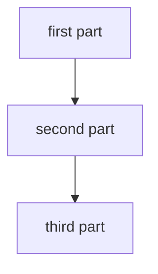

# Diagram reference

Applies to per-kind entries under `.canon/diagrams/`. Skip for `index.md`, which is regenerated by `canon indexes regen`.

A diagram entry answers one question about the system with one or more Mermaid diagrams and the prose that makes them readable. It is not a rendering of the file tree. The check for any single line: does it tell a reader something the code layout would not have told them? If not, it belongs in `canon/context/`.

## Scope

Governs per-kind diagram entries under `.canon/diagrams/`: which question each answers, which kinds exist and what each is drawn from, the frontmatter, and the explanation prose beneath the fence. It states the voice for that prose, which is the yield the `write-human` skill grants a surface whose own standard sets one.

Does not govern:

- How the drawing inside the fence is laid out, budgeted, made accessible, and verified against its render: `mermaid.md`
- Rhythm and sentence construction in explanation prose: the `write-human` skill, whose rules the yield does not lift beyond voice
- Language, word choice, punctuation, and formatting in explanation prose and node labels: `markdown.md`, which the yield does not reach
- The mechanism behind any component a diagram draws: `context.md`
- UI layout, on-screen copy, and interaction intent: `wireframes.md`
- The decision record a components diagram is drawn from: `architecture.md`

## What a working entry looks like

An entry works when a reader who has not opened the repository can answer its question:

- What are the parts, and which ones talk to each other?
- Which direction does the work flow, and where does it start?
- What would break if one box were removed?

An entry that fails these is non-conforming regardless of whether it satisfies every section rule below. The fences are the means. These three questions are the test.

## Frontmatter

- `title` (required): sentence case, names what the entry answers (`System context`, `Request flow`), not what it draws.
- `description` (required): one line on which question the entry settles and which source signal drives it.
- `category` (required): the diagram kind, one of the five in Entry kinds. It is the grouping field `canon indexes regen` renders headings from.
- `verified` (required): the short commit SHA an entry was last checked against and the ISO date of that check, separated by a space (`73e9a3f8 2026-08-02`). A stub nobody has drawn yet carries the literal `TODO: never verified` instead, which is the one other accepted value. <!-- canon-allow-reference: illustrates the field's two-token format, which a qualified sha would misstate -->
- `stale` (optional): one line naming what changed under the entry since that check. Nothing writes it on its own, so it sits on an entry because a reader put it there and is absent everywhere else.

The first three feed `.canon/diagrams/index.md` when regenerated. The catalog sorts categories alphabetically rather than in narrative order, so an entry cannot rely on its position to introduce another. Each entry names its own starting point, and the catalog's subtitle routes a first-time reader to the system context entry.

The marker fields reach the catalog through neither route. `canon indexes regen` reads `title`, `description`, and `category` and ignores every other key, so a marker changes no generated file. A reader picks it up by opening the entry, which is where it sits above the diagram and where anyone deciding whether to trust the picture is already standing.

One writer touches `verified`, which is the pass that renders an entry and reads the picture back, and it clears `stale` at the same time. A reader who notices the picture has drifted writes `stale` by hand. Keeping the two fields apart is what lets a reader tell a diagram nobody has checked since the code moved from one that was checked and found correct.

## Entry kinds

Five kinds, each with a fixed filename and a fixed `category` value. Write a kind only when its source signal exists, and leave the rest absent rather than padding the folder.

- `system-context.md`, category `System context` (`flowchart TB`): who uses the system, what it talks to, and where its boundary sits. Drawn from `canon/REQUIREMENTS.md`. This is the entry a reader outside the team opens first, and the only kind that draws the world outside the boundary.
- `components.md`, category `Components` (`flowchart TB` with `subgraph` boundaries): the layered structure inside the boundary. Drawn from `canon/ARCHITECTURE.md`.
- `request-flow.md`, category `Request flow` (`sequenceDiagram`): a request lifecycle, an agent loop, or an interaction between actors.
- `data-pipeline.md`, category `Data pipeline` (`flowchart TB`): retrieval, ranking, queues, or ETL.
- `deployment.md`, category `Deployment` (`flowchart TB`): hosts, services, and infrastructure config.

The filenames are fixed rather than free, so a session refreshing one kind finds the file it is meant to overwrite instead of writing a second entry beside it under a name of its own.

Stay inside `flowchart` and `sequenceDiagram`. C4, state, ER, and class diagrams render inconsistently across viewers.

The kinds drift at rates spanning roughly an order of magnitude, which is why they are separate files. A deploy change rewrites one entry and leaves the other four untouched.

A second entry for one kind takes a suffixed name (`request-flow-admin.md`) and repeats the kind's `category` verbatim, which is what the grouping field is for. One entry per kind is the ordinary case, so most catalogs show one entry under each heading.

## Budgets

- Keep an entry to one diagram by default. A second fence in the same file needs its own H2 naming what it adds, and a third is a sign the entry covers two kinds.

## Explanation

- One to three short paragraphs below each diagram. Plain English and pedagogical.
- Lead with what the diagram shows. Follow with why this shape was chosen and what alternative was rejected, when the choice was non-obvious.
- Reference one or two specific code paths the reader can open. Do not enumerate every file. Spell each one exactly, since a reader deciding whether the entry still holds starts by opening the paths it names and a path that resolves to nothing costs them that read.
- Do not duplicate prose across entries. An entry that restates its neighbor has taken the neighbor's job.
- The audience is mixed, so vocabulary runs as a gradient across the set. `System context` assumes no knowledge of the repository. `Deployment` may assume the reader has read the others.

This section states the voice for the surface, which is what claims the yield the `write-human` skill grants to a surface whose own standard sets it. Explanation prose is pedagogical here and the default developer-facing voice does not apply. The yield covers voice alone. The rhythm and density rules that skill carries stay in force, as do the language bans, punctuation, and formatting in `markdown.md`, which grants no yield at all.

## What moves to canon/context/

Implementation detail that answers how a component is built belongs in a `canon/context/` entry, not a diagram:

- Function names, call signatures, and lifecycle ordering
- Library versions, config keys, and environment variable names
- Retry counts, timeouts, and batch sizes
- Workarounds and rejected approaches that need more than one sentence

Reference the context entry by path when a reader needs the mechanism. The diagram stays answerable on its own for structure and flow.

## Maintenance

- When the system changes, update the entries whose source signal changed and leave the rest alone. Rewriting the folder wholesale reproduces the defect the per-kind split exists to end.
- A diagram showing a defunct host or library is worse than no diagram. Audit the affected entry in the same PR.
- `System context` has no named source signal beyond `canon/REQUIREMENTS.md`, so nothing tells a session it went stale. Re-read it when the boundary or the set of external dependencies moves.
- Nothing watches the folder for you. The entries are redrawn on demand rather than swept on every ship, so `verified` carries the whole signal: an entry whose date sits far behind the branch is due a read, and no pass is going to name which one.

## Template

The filename and the `category` value both come from Entry kinds and are fixed per kind. A stub nobody has drawn yet carries `TODO: never verified` in place of the SHA and date. The node names and labels inside the fence are placeholders, written bare because Mermaid reads an angle bracket as markup.

What goes inside the fence, and how the render is checked once it is drawn, is `mermaid.md`. This template fixes the frame around it.

````markdown
---
title: <what the entry answers>
description: <which question it settles and which source signal drives it>
category: <the kind, verbatim from Entry kinds>
verified: <short-sha> <YYYY-MM-DD>
---

# <what the entry answers>



<One paragraph leading with what the diagram shows.>

<One paragraph on why this shape was chosen and what was rejected, where the choice was non-obvious. Name one or two code paths the reader can open.>
````
